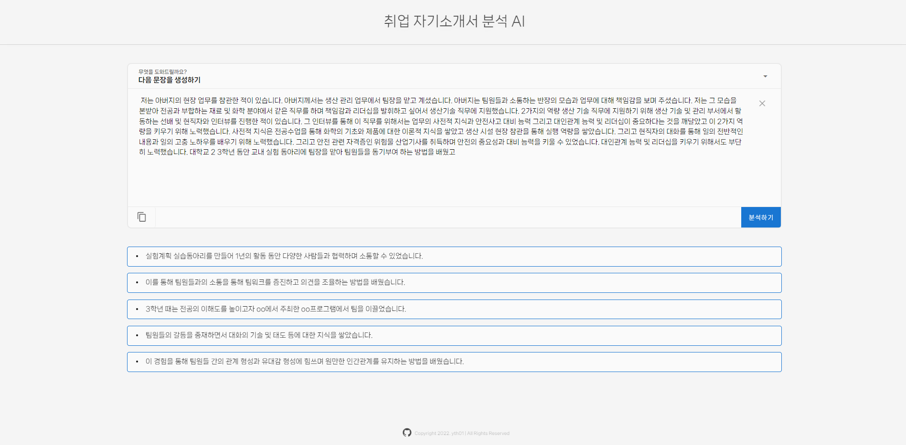
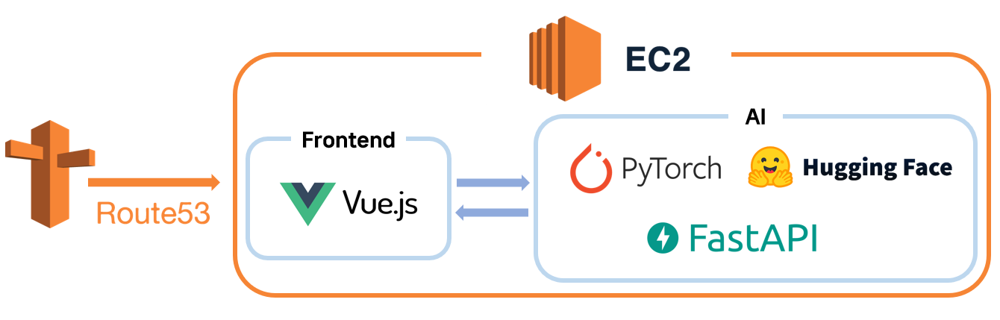

# 취업 자기소개서 분석 AI

핵심 역량 중심의 채용 트렌드와 개인의 직무 성향을 파악하는 것이 중요해지고 있다.

이 서비스를 통해 다양한 측면으로 자기소개서를 분석하고 숨겨진 인사이트를 발견할 수 있도록 돕는다.

### URL

- ~~http://kocover.shop~~

### Service

- 다음 문장 생성하기
- 소제목 추천받기
- 좋은 점 조언 받기
- 아쉬운 점 조언 받기
- 잘 나타나는 3문장 알아보기

### Web View

### Architecture

### Design

- [[Figma] Prototype](https://www.figma.com/file/qyInsTRUpZ0wm55Js5Y2KR/kocover?t=tVJDpqh8mUQpfAbP-0)

### AI API Docs

| API                                                                                                                       | Description         | Model    |
| ------------------------------------------------------------------------------------------------------------------------- | ------------------- | -------- |
| [[POST] /generative-model/next-sentence](https://github.com/yth01/ko-cover-letter-ai/wiki/Next-Sentence-Generative-Model) | 다음 문장 생성 모델 | KoGPT2   |
| [[POST] /generative-model/title](https://github.com/yth01/ko-cover-letter-ai/wiki/Title-Generative-Model)                 | 소제목 생성 모델    | KoBART   |
| [[POST] /generative-model/good-advice](https://github.com/yth01/ko-cover-letter-ai/wiki/Good-Advice-Generative-Model)     | 좋은점 생성 모델    | KoBART   |
| [[POST] /generative-model/regret-advice](https://github.com/yth01/ko-cover-letter-ai/wiki/Regret-Advice-Generative-Model) | 아쉬운점 생성 모델  | KoBART   |
| [[POST] /summary-model/answer](https://github.com/yth01/ko-cover-letter-ai/wiki/Answer-Summary-Model)                     | 답변 요약 모델      | TextRank |
